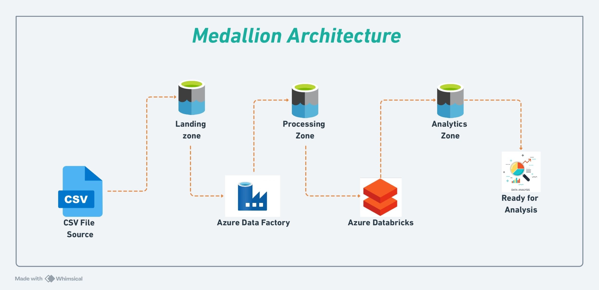

# Azure Data Pipeline Project: End-to-End Data Engineering

## Introduction

This project demonstrates the design and implementation of a fully automated data pipeline using **Azure Data Factory (ADF)**, **Azure Databricks**, and **Azure Synapse Analytics**. The pipeline efficiently ingests, transforms, and stores data for analysis, empowering data analysts to generate insights and create impactful dashboards.

---

## Architecture  

---

## Project Overview

### 1. **Data Ingestion**
- **Tool Used**: Azure Data Factory (ADF)
- **Process**: Used ADF to ingest data from a **.CSV** file and load it into **Azure Blob Storage**. ADF orchestrated the ingestion process, ensuring reliable and scheduled data extraction.

### 2. **Data Transformation**
- **Tool Used**: Azure Databricks
- **Process**: The raw data was processed and transformed using **Azure Databricks**, where complex transformations were carried out. PySpark was utilized to clean, format, and aggregate the data to make it suitable for analysis.

### 3. **Data Storage & Querying**
- **Tool Used**: Azure Synapse Analytics
- **Process**: The transformed data was stored in **Azure Synapse Analytics**, allowing for efficient querying and filtering of large datasets using SQL. This process enabled data analysts to work with structured, queryable data.

### 4. **Data Analysis & Insights**
- **Outcome**: The processed data was made accessible to data analysts for creating dashboards and conducting research. The insights derived from the data empowered stakeholders to make data-driven decisions and visualize key metrics.

---

## Technologies Used

- **Azure Data Factory (ADF)**: Orchestration and automation of data ingestion pipelines.
- **Azure Databricks**: Scalable data transformation using PySpark.
- **Azure Synapse Analytics**: Data storage and querying for analysis.
- **Azure Blob Storage**: Cloud storage for raw data.

---
## Data Used  

The project utilizes four key datasets to simulate the Paris Olympics data pipeline. Each dataset provides specific details crucial for building a meaningful and efficient pipeline.  

### 1. **Athletes Dataset**  
This dataset contains information about athletes participating in the Olympics, including their names, countries, and disciplines.  
- **File Name**: [Athletes.csv](link-to-athletes-file)  

---

### 2. **Coaches Dataset**  
Details about coaches involved in the Olympics, such as their names, countries, disciplines, and events.  
- **File Name**: [Coaches.csv](link-to-coaches-file)  

---

### 3. **Entries Gender Dataset**  
Represents the gender distribution of participants across different Olympic disciplines.  
- **File Name**: [EntriesGender.csv](link-to-entries-gender-file)  

---

### 4. **Medals Dataset**  
Tracks the medal standings of various countries, including gold, silver, bronze, and total medals won.  
- **File Name**: [Medals.csv](link-to-medals-file)  

---

## Project Details

The project automates the data engineering workflow, allowing for seamless integration between **data ingestion**, **data transformation**, and **data querying**.

- **Step 1**: ADF ingests raw **.CSV** data into Azure Blob Storage.
- **Step 2**: Databricks processes the data, applying necessary transformations and business rules.
- **Step 3**: The cleaned data is stored in **Azure Synapse Analytics**, where analysts can use SQL to explore and query the data.
- **Step 4**: Analysts can build dashboards using the accessible, transformed data to derive insights and support business decision-making.

---

## Conclusion

This end-to-end Azure data pipeline project highlights the power of Azure’s ecosystem in automating data workflows and empowering analysts with high-quality data for insights and decision-making. By using **Azure Data Factory**, **Azure Databricks**, and **Azure Synapse Analytics**, this solution offers a scalable and efficient approach to modern data engineering.
